[](https://jjeff.github.io/electron-direct-ipc/)
[](https://github.com/semantic-release/semantic-release)

# Electron Direct IPC

**Type-safe, high-performance inter-process communication for Electron applications**

Electron Direct IPC provides direct renderer-to-renderer communication via MessageChannel, bypassing the main process for improved performance and reduced latency. It's modeled after Electron's ipcRenderer/ipcMain API for familiarity. With full TypeScript support (including send/receive and invoke/handle message/argument/return types), automatic message coalescing, and a clean API, it's designed for real-time applications that need fast, reliable IPC.

## Features

- 🚀 **Direct Communication** - Renderers communicate via MessageChannel, bypassing main process
- 🔒 **Type-Safe** - Full TypeScript generics for compile-time safety
- ⚡ **High Performance** - Microtask-based throttling for high-frequency updates
- 🎯 **Flexible Targeting** - Send by identifier, webContentsId, or URL pattern
- 🔄 **Bidirectional** - Request/response with async invoke/handle pattern
- 📡 **Event-Driven** - Built on EventEmitter with automatic lifecycle management
- 🧪 **Well Tested** - Comprehensive unit, integration, and E2E tests with full coverage

## Table of Contents

- [Installation](#installation)
- [Quick Start](#quick-start)
- [Core Concepts](#core-concepts)
- [API Reference](#api-reference)
  - [DirectIpcRenderer](#directipcrenderer)
  - [DirectIpcThrottled](#directipcthrottled)
  - [DirectIpcMain](#directipcmain)
- [Usage Patterns](#usage-patterns)
- [Performance Guide](#performance-guide)
- [Testing](#testing)
- [Architecture](#architecture)
- [Migration Guide](#migration-guide)

## Installation

```bash
npm install electron-direct-ipc
```

Or if this is part of your Electron monorepo:

```bash
# Already included in your dependencies
```

## Quick Start

### 1. Set up the main process

```typescript
// main.ts
import { DirectIpcMain } from 'electron-direct-ipc/main'

const directIpcMain = new DirectIpcMain()

// That's it! DirectIpcMain handles all the coordination automatically
```

### 2. Define your message types

```typescript
// types.ts
type MyMessages = {
  'user-action': (action: 'play' | 'pause' | 'stop', value: number) => void
  'position-update': (x: number, y: number) => void
  'volume-change': (level: number) => void
}

type MyInvokes = {
  'get-user': (userId: string) => Promise<{ id: string; name: string }>
  calculate: (a: number, b: number) => Promise<number>
}

type WindowIds = 'controller' | 'output' | 'thumbnails'
```

### 3. Use in renderer processes

```typescript
// controller-renderer.ts
import { DirectIpcRenderer } from 'electron-direct-ipc/renderer'

const directIpc = DirectIpcRenderer.instance<MyMessages, MyInvokes, WindowIds>({
  identifier: 'controller',
})

// Send a message with multiple arguments
await directIpc.sendToIdentifier('output', 'user-action', 'play', 42)

// Send high-frequency updates (throttled)
for (let i = 0; i < 1000; i++) {
  directIpc.throttled.sendToIdentifier('output', 'position-update', i, i)
}
// Throttling coalesces - only the last position (999, 999) is actually sent!
```

```typescript
// output-renderer.ts
import { DirectIpcRenderer } from 'electron-direct-ipc/renderer'

const directIpc = DirectIpcRenderer.instance<MyMessages, MyInvokes, WindowIds>({
  identifier: 'output',
})

// Listen for messages
directIpc.on('user-action', (sender, action, value) => {
  console.log(`${sender.identifier} sent action: ${action} with value: ${value}`)
})

// Listen for high-frequency updates (throttled)
directIpc.throttled.on('position-update', (sender, x, y) => {
  // Called at most once per microtask with latest values
  updateUI(x, y)
})

// Handle invoke requests
directIpc.handle('get-user', async (sender, userId) => {
  const user = await database.getUser(userId)
  return { id: user.id, name: user.name }
})

// Invoke another renderer
const result = await directIpc.invokeIdentifier('controller', 'calculate', 5, 10)
console.log(result) // 15
```

## Core Concepts

### MessageChannel-Based Communication

DirectIPC uses the Web [MessageChannel API](https://developer.mozilla.org/en-US/docs/Web/API/MessageChannel) for direct communication between renderers. The main process coordinates the initial connection, then gets out of the way:

```
Renderer A                Main Process              Renderer B
    |                          |                         |
    |---GET_PORT('output')---->|                         |
    |    creates MessageChannel and distributes ports    |
    |<----PORT_MESSAGE---------|                         |
    |                          |-----PORT_MESSAGE------->|
    |                          |                         |
    |<=============MessageChannel established===========>|
    |                          |                         |
    |-----------------------messages-------------------->|
    |<----------------------messages---------------------|
                   (main process not involved)
```

### Targeting Modes

DirectIPC supports three ways to target renderers:

1. **By Identifier** (recommended) - Human-readable window identifiers
2. **By WebContentsId** - Electron's internal ID
3. **By URL Pattern** - Match windows by URL (regex supported)

```typescript
// By identifier (best for readability)
await directIpc.sendToIdentifier('output', 'play')

// By webContentsId (best for precision)
await directIpc.sendToWebContentsId(5, 'play')

// By URL pattern (best for dynamic windows)
await directIpc.sendToUrl(/^settings:\/\//, 'theme-changed', 'dark')
```

### Throttled vs Non-Throttled

DirectIPC provides two communication modes:

**Non-Throttled (default)** - Every message is delivered

```typescript
// Every message sent
directIpc.sendToIdentifier('output', 'button-clicked')
```

**Throttled** - Only latest value per microtask is delivered (lossy)

```typescript
// Only the last value (999) is sent
for (let i = 0; i < 1000; i++) {
  directIpc.throttled.sendToIdentifier('output', 'position', i)
}
```

### Type Safety

DirectIPC uses TypeScript generics to ensure compile-time type safety:

```typescript
// Define your types
type Messages = {
  'position-update': (x: number, y: number) => void
}

// Get full autocomplete and type checking
directIpc.sendToIdentifier('output', 'position-update', 10, 20) // ✅
directIpc.sendToIdentifier('output', 'position-update', '10', '20') // ❌ Type error!
directIpc.sendToIdentifier('output', 'wrong-channel', 10, 20) // ❌ Type error!

// Listeners are also type-safe
directIpc.on('position-update', (sender, x, y) => {
  // x and y are inferred as numbers
  const sum: number = x + y // ✅
})
```

## API Reference

### DirectIpcRenderer

Main class for renderer process communication.

#### Constructor & Singleton

```typescript
// Singleton pattern (recommended)
const directIpc = DirectIpcRenderer.instance<TMessages, TInvokes, TIdentifiers>({
  identifier: 'my-window',
  log: customLogger,
})

// For testing (creates new instance)
const directIpc = DirectIpcRenderer._createInstance<TMessages, TInvokes, TIdentifiers>(
  { identifier: 'test-window' },
  { ipcRenderer: mockIpcRenderer }
)
```

#### Sending Messages

```typescript
// Send to specific target
await directIpc.sendToIdentifier(
  identifier: TIdentifiers | RegExp,
  message: keyof TMessages,
  ...args: Parameters<TMessages[message]>
): Promise<void>

await directIpc.sendToWebContentsId(
  webContentsId: number,
  message: keyof TMessages,
  ...args: Parameters<TMessages[message]>
): Promise<void>

await directIpc.sendToUrl(
  url: string | RegExp,
  message: keyof TMessages,
  ...args: Parameters<TMessages[message]>
): Promise<void>

// Broadcast to multiple targets
await directIpc.sendToAllIdentifiers(
  identifierPattern: TIdentifiers | RegExp,
  message: keyof TMessages,
  ...args: Parameters<TMessages[message]>
): Promise<void>

await directIpc.sendToAllUrls(
  urlPattern: string | RegExp,
  message: keyof TMessages,
  ...args: Parameters<TMessages[message]>
): Promise<void>
```

#### Receiving Messages

```typescript
// Register listener
directIpc.on<K extends keyof TMessages>(
  event: K,
  listener: (sender: DirectIpcTarget, ...args: Parameters<TMessages[K]>) => void
): this

// Remove listener
directIpc.off<K extends keyof TMessages>(
  event: K,
  listener: Function
): this
```

#### Invoke/Handle Pattern

```typescript
// Register handler (receiver)
directIpc.handle<K extends keyof TInvokes>(
  channel: K,
  handler: (sender: DirectIpcTarget, ...args: Parameters<TInvokes[K]>) => ReturnType<TInvokes[K]>
): void

// Invoke handler (sender)
const result = await directIpc.invokeIdentifier<K extends keyof TInvokes>(
  identifier: TIdentifiers | RegExp,
  channel: K,
  timeout?: number,
  ...args: Parameters<TInvokes[K]>
): Promise<Awaited<ReturnType<TInvokes[K]>>>

const result = await directIpc.invokeWebContentsId<K extends keyof TInvokes>(
  webContentsId: number,
  channel: K,
  timeout?: number,
  ...args: Parameters<TInvokes[K]>
): Promise<Awaited<ReturnType<TInvokes[K]>>>

const result = await directIpc.invokeUrl<K extends keyof TInvokes>(
  url: string | RegExp,
  channel: K,
  timeout?: number,
  ...args: Parameters<TInvokes[K]>
): Promise<Awaited<ReturnType<TInvokes[K]>>>
```

#### Utility Methods

```typescript
// Get current renderer map
directIpc.getMap(): DirectIpcTarget[]

// Get this renderer's identifier
directIpc.getMyIdentifier(): TIdentifiers | undefined

// Set this renderer's identifier
directIpc.setIdentifier(identifier: TIdentifiers): void

// Resolve target to webContentsId
directIpc.resolveTargetToWebContentsId(target: {
  webContentsId?: number
  identifier?: TIdentifiers | RegExp
  url?: string | RegExp
}): number | undefined

// Refresh renderer map
await directIpc.refreshMap(): Promise<void>

// Configure timeout
directIpc.setDefaultTimeout(ms: number): void
directIpc.getDefaultTimeout(): number

// Clean up
directIpc.closeAllPorts(): void
directIpc.clearPendingInvokes(): void
```

#### Events (localEvents)

```typescript
// Listen for internal DirectIpc events
directIpc.localEvents.on('target-added', (target: DirectIpcTarget) => {})
directIpc.localEvents.on('target-removed', (target: DirectIpcTarget) => {})
directIpc.localEvents.on('map-updated', (map: DirectIpcTarget[]) => {})
directIpc.localEvents.on('message-port-added', (target: DirectIpcTarget) => {})
directIpc.localEvents.on('message', (sender: DirectIpcTarget, message: unknown) => {})
```

### DirectIpcThrottled

Accessed via `directIpc.throttled` property. Provides lossy message coalescing for high-frequency updates.

#### When to Use Throttled

✅ **Use throttled when:**

- Sending high-frequency state updates (position, volume, progress)
- Only the latest value matters (replaceable state)
- Experiencing backpressure (sender faster than receiver)
- UI updates that can safely skip intermediate frames

❌ **Don't use throttled when:**

- Every message is unique and important
- Messages represent discrete events
- Order matters for correctness
- Need guaranteed delivery

#### Throttled API

All send/receive methods available, same signatures as DirectIpcRenderer:

```typescript
// Send throttled
directIpc.throttled.sendToIdentifier('output', 'position', x, y)
directIpc.throttled.sendToWebContentsId(5, 'volume', level)
directIpc.throttled.sendToUrl(/output/, 'progress', percent)

// Receive throttled
directIpc.throttled.on('position', (sender, x, y) => {
  // Called at most once per microtask
})

// Proxy methods (non-throttled)
directIpc.throttled.handle('get-data', async (sender, id) => data)
await directIpc.throttled.invokeIdentifier('output', 'calculate', a, b)

// Access underlying directIpc
directIpc.throttled.directIpc.sendToIdentifier('output', 'important-event')

// Access localEvents
directIpc.throttled.localEvents.on('target-added', (target) => {})
```

#### How Throttling Works

**Send-side coalescing:**

```typescript
// In one event loop tick:
directIpc.throttled.sendToIdentifier('output', 'position', 1, 1)
directIpc.throttled.sendToIdentifier('output', 'position', 2, 2)
directIpc.throttled.sendToIdentifier('output', 'position', 3, 3)

// Only position (3, 3) is sent on next microtask (~1ms later)
// Messages to different targets/channels are NOT coalesced
```

**Receive-side coalescing:**

```typescript
// Renderer receives many messages in one tick
// Internal handler queues them all
// Listeners called once per microtask with latest values

directIpc.throttled.on('position', (sender, x, y) => {
  console.log(x, y) // Only prints latest value
})
```

### DirectIpcMain

Coordinates MessageChannel connections between renderers.

```typescript
import { DirectIpcMain } from 'electron-direct-ipc/main'

// Create singleton instance
const directIpcMain = new DirectIpcMain({
  log: customLogger, // optional
})

// That's it! DirectIpcMain automatically:
// - Tracks all renderer windows
// - Creates MessageChannels when renderers request connections
// - Broadcasts map updates when windows open/close
// - Cleans up when windows close
```

**No manual coordination needed!** DirectIpcMain handles everything automatically.

## Usage Patterns

### Pattern 1: Simple Messaging

```typescript
// Sender
await directIpc.sendToIdentifier('output', 'play-button-clicked')

// Receiver
directIpc.on('play-button-clicked', (sender) => {
  playbackEngine.play()
})
```

### Pattern 2: State Updates

```typescript
// Sender (high-frequency updates)
videoPlayer.on('timeupdate', (currentTime) => {
  directIpc.throttled.sendToIdentifier('controller', 'playback-position', currentTime)
})

// Receiver
directIpc.throttled.on('playback-position', (sender, position) => {
  seekBar.update(position)
})
```

### Pattern 3: Request-Response

```typescript
// Receiver (set up handler)
directIpc.handle('get-project-data', async (sender, projectId) => {
  const project = await database.getProject(projectId)
  return {
    id: project.id,
    name: project.name,
    songs: project.songs,
  }
})

// Sender (invoke handler)
try {
  const project = await directIpc.invokeIdentifier(
    'controller',
    'get-project-data',
    5000, // 5 second timeout
    'project-123'
  )
  console.log(project.name)
} catch (error) {
  console.error('Failed to get project:', error)
}
```

### Pattern 4: Broadcast

```typescript
// Send to all windows matching pattern
await directIpc.sendToAllIdentifiers(/output-.*/, 'theme-changed', 'dark')

// Send to all windows with specific URL
await directIpc.sendToAllUrls(/^settings:\/\//, 'preference-updated', 'volume', 75)
```

### Pattern 5: Mixed Throttled/Non-Throttled

```typescript
// High-frequency position updates (throttled)
directIpc.throttled.on('cursor-position', (sender, x, y) => {
  cursor.moveTo(x, y)
})

// Important user actions (NOT throttled)
directIpc.on('cursor-click', (sender, button, x, y) => {
  handleClick(button, x, y)
})
```

### Pattern 6: Error Handling

```typescript
// Handle invoke errors
directIpc.handle('risky-operation', async (sender, data) => {
  if (!isValid(data)) {
    throw new Error('Invalid data')
  }
  return await performOperation(data)
})

// Caller handles rejection
try {
  const result = await directIpc.invokeIdentifier('worker', 'risky-operation', myData)
} catch (error) {
  console.error('Operation failed:', error.message)
}
```

### Pattern 7: Dynamic Window Discovery

```typescript
// Get all available renderers
const targets = directIpc.getMap()
console.log(
  'Available windows:',
  targets.map((t) => t.identifier)
)

// Listen for new windows
directIpc.localEvents.on('target-added', (target) => {
  console.log(`New window: ${target.identifier}`)

  // Send welcome message
  directIpc.sendToWebContentsId(target.webContentsId, 'welcome')
})

// Listen for windows closing
directIpc.localEvents.on('target-removed', (target) => {
  console.log(`Window closed: ${target.identifier}`)
})
```

## Performance Guide

### Choosing Throttled vs Non-Throttled

**Use regular `directIpc` for:**

- User actions (clicks, keypresses)
- State changes (song changed, clip added)
- Commands (play, pause, stop)
- Discrete events that must all be delivered

**Use `directIpc.throttled` for:**

- Mouse/cursor position (60+ Hz)
- Playback position (30-60 Hz)
- Volume levels (real-time)
- Progress bars (real-time)
- Any replaceable state where only latest value matters

### Latency Characteristics

| Method                      | Latency | Delivery            | Use Case         |
| --------------------------- | ------- | ------------------- | ---------------- |
| `directIpc.send*`           | ~0ms    | Guaranteed          | Events, commands |
| `directIpc.throttled.send*` | ~1ms    | Lossy (latest only) | State updates    |
| `directIpc.invoke*`         | ~1-5ms  | Guaranteed          | RPC calls        |

### Memory Usage

DirectIPC is designed to be lightweight:

- DirectIpcRenderer: ~8KB per instance
- DirectIpcThrottled: ~2KB per instance (auto-created)
- MessageChannel: ~1KB per connection
- Pending messages: O(channels × targets)

### Benchmarks

On a modern laptop (M1 MacBook):

- Send 1000 non-throttled messages: ~2ms
- Send 1000 throttled messages: ~2ms (but only 1 delivered)
- Invoke round-trip: ~1.5ms average
- Connect new renderer: ~10ms

## Testing

DirectIPC includes comprehensive test utilities.

### Unit Testing

```typescript
import { DirectIpcRenderer } from 'electron-direct-ipc/renderer'
import { describe, it, expect, vi } from 'vitest'

describe('My component', () => {
  it('should send message when button clicked', async () => {
    const mockIpcRenderer = {
      on: vi.fn(),
      invoke: vi.fn().mockResolvedValue([]),
    }

    const directIpc = DirectIpcRenderer._createInstance(
      { identifier: 'test' },
      { ipcRenderer: mockIpcRenderer as any }
    )

    // Spy on send method
    const spy = vi.spyOn(directIpc, 'sendToIdentifier').mockResolvedValue()

    // Test your code
    await myComponent.onClick()

    expect(spy).toHaveBeenCalledWith('output', 'play-clicked')
  })
})
```

### Integration Testing

See [DirectIpc.integration.test.ts](tests/DirectIpc.integration.test.ts) for examples of testing full renderer-to-renderer communication with MessageChannel.

### E2E Testing with Playwright

The project includes 21 comprehensive E2E tests covering window-to-window communication, throttled messaging, and page reload scenarios. See [tests/e2e/example.spec.ts](tests/e2e/example.spec.ts) for the full test suite.

```typescript
import { test, expect } from '@playwright/test'
import { _electron as electron } from 'playwright'

test('renderer communication', async () => {
  const app = await electron.launch({ args: ['main.js'] })

  // Get windows
  const controller = await app.firstWindow()
  const output = await app.waitForEvent('window')

  // Trigger action in controller
  await controller.click('#play-button')

  // Verify message received in output
  const isPlaying = await output.evaluate(() => {
    return window.playbackState === 'playing'
  })

  expect(isPlaying).toBe(true)

  await app.close()
})
```

## Architecture

### Overview

```mermaid
graph TB
    subgraph Main["Main Process"]
        DIM[DirectIpcMain<br/>• Tracks all renderer windows<br/>• Creates MessageChannels on demand<br/>• Broadcasts map updates]
    end

    subgraph RendererA["Renderer A (e.g., Controller)"]
        DIRA[DirectIpcRenderer<br/>• Message sending<br/>• Event receiving<br/>• Invoke/handle]
        THROT_A[.throttled<br/>• Coalescing]
        DIRA --- THROT_A
    end

    subgraph RendererB["Renderer B (e.g., Output)"]
        DIRB[DirectIpcRenderer<br/>• Message sending<br/>• Event receiving<br/>• Invoke/handle]
        THROT_B[.throttled<br/>• Coalescing]
        DIRB --- THROT_B
    end

    DIM -.IPC Setup.-> DIRA
    DIM -.IPC Setup.-> DIRB
    DIRA <==MessageChannel<br/>Direct Connection==> DIRB
```



### Message Flow


**Key Points:**

1. **Connection Setup** - One-time overhead (~10ms) to establish MessageChannel
2. **Message Sending** - Direct port communication bypasses main process (near-zero overhead)
3. **Message Receiving** - Non-throttled calls listeners immediately; throttled coalesces per microtask
4. **Cleanup** - Automatic when windows close

### Design Decisions

**Why MessageChannel?**

- Zero main process overhead after setup
- Native browser API (well-tested, performant)
- Supports structured clone algorithm
- Automatic cleanup when windows close

**Why microtask-based throttling?**

- Predictable ~1ms latency
- Natural coalescing boundary (one tick)
- No timers needed (more efficient)
- Works with React's batching

**Why singleton pattern?**

- One DirectIpcRenderer per renderer process
- Prevents duplicate port connections
- Centralized lifecycle management
- Easier debugging

## Migration Guide

### From Electron IPC

```typescript
// Before (Electron IPC via main)
ipcRenderer.send('message-to-output', data)
ipcMain.on('message-to-output', (event, data) => {
  outputWindow.webContents.send('message', data)
})

// After (DirectIPC)
await directIpc.sendToIdentifier('output', 'message', data)
directIpc.on('message', (sender, data) => {
  // handle message
})
```

### From Custom IPC Solutions

If you have a custom IPC system:

1. Define your message/invoke maps
2. Replace send calls with `directIpc.send*`
3. Replace listeners with `directIpc.on`
4. Replace RPC with `directIpc.invoke*` and `directIpc.handle`
5. Remove main process coordination code (DirectIpcMain handles it)

### Breaking Changes from v1.x

- `DirectIpcThrottled` now accessed via `directIpc.throttled` (auto-created)
- Constructor is now private (use singleton `.instance()` or `._createInstance()`)
- Some method signatures changed for better type safety

## Contributing

Contributions welcome! Please read our [Contributing Guide](CONTRIBUTING.md) first.

This project uses [semantic-release](https://semantic-release.gitbook.io/) for automated versioning and releases. All commits must follow the [Conventional Commits](https://www.conventionalcommits.org/) specification. See our [Semantic Release Guide](SEMANTIC_RELEASE.md) for details.

## License

MIT © Jeff Robbins

## Links

- [GitHub Repository](https://github.com/jjeff/electron-direct-ipc)
- [Issue Tracker](https://github.com/jjeff/electron-direct-ipc/issues)
- [API Documentation](https://jjeff.github.io/electron-direct-ipc)
